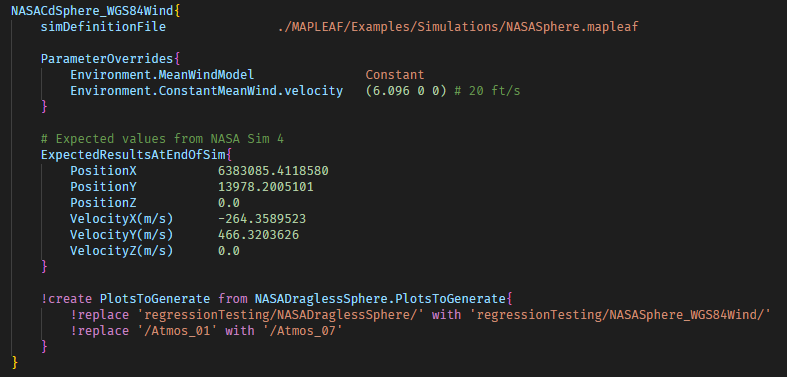

<p align="center">
  
  <h1 align="center">Modular Aerospace Prediction Lab for Engines and Aero Forces</h1>
</p>

<p align="center">
<a align="center" href="https://github.com/henrystoldt/mapleaf/actions"></a>
  <a align="center" href="https://github.com/henrystoldt/mapleaf/actions"></a>
  <a align="center" href="https://henrystoldt.github.io/MAPLEAF/"></a>
  <a align="center" href="https://codecov.io/gh/henrystoldt/mapleaf"></a>
  
  <a align="center" href="https://lbesson.mit-license.org/"></a>
</p>

## Install:
`pip install MAPLEAF`
    
## Running a Simulation
`$ mapleaf path/to/SimDefinitionFile.mapleaf`  

Sample simulation definitions: [MAPLEAF/Examples/Simulations](https://github.com/henrystoldt/MAPLEAF/tree/master/MAPLEAF/Examples/Simulations)  
Example cases be run with just the case name: `$ mapleaf NASATwoStageOrbitalRocket`  
This is the same as running: `$ mapleaf MAPLEAF/Examples/Simulations/NASATwoStageOrbitalRocket.mapleaf` from MAPLEAF's install location

### Simulation Definition Files
Brief overview below. **More info, and definitions of all possible options in:** [SimDefinitionTemplate.mapleaf](https://github.com/henrystoldt/MAPLEAF/blob/master/SimDefinitionTemplate.mapleaf)

Format is a simple key-value syntax similar to JSON or YAML.  
Dictionaries can be nested arbitrarily deeply and are brace-delimited.  
Keys and values in a dictionary are separated by the first whitespace in their line  
No multiline values

Example:
```  
SimControl{
  timeDiscretization    RK45Adaptive

  TimeStepAdaptation{
    controller          PID
    PID.coefficients    -0.01 -0.001 0
    targetError         0.0001
  }
}
```

[Code folding](https://code.visualstudio.com/docs/editor/codebasics#_folding) and [syntax highlighting](https://marketplace.visualstudio.com/items?itemName=MAPLEAF.MAPLEAF) are helpful in maintaining a file overview:


The possible top level dictionaries are 'Optimization', 'MonteCarlo', 'SimControl', 'Environment', and 'Rocket'.
Of these, only the 'Rocket' dictionary is strictly required to run a simulation, and defines the rocket's initial position/velocity and the inertial/aerodynamic/control models used to simulate it.  
The rocket is defined by nested subdictionaries, where the first level of nesting defines the rocket's stage(s) and the second level defines the component(s) in each stage:


Default values from the defaultConfigValues dictionary in [MAPLEAF/IO/SimDefinition.py](https://github.com/henrystoldt/MAPLEAF/blob/master/MAPLEAF/IO/SimDefinition.py) will fill in for omitted keys.
Most defaults match the values in [SimDefinitionTemplate.mapleaf](https://github.com/henrystoldt/MAPLEAF/blob/master/SimDefinitionTemplate.mapleaf).

## Simulation Outputs
Depending on the options specified in the `SimControl` dictionary, MAPLEAF will output:
- Detailed tabulated simulation position, component force, aerodynamic coefficient and control logs (see SimControl.loggingLevel):


- Flight animations (see SimControl.plot)  


- Flight path visualizations (see SimControl.plot - [Mayavi](https://github.com/enthought/mayavi) is required to render these ones showing the Earth)  


- Plots of any logged parameter (see SimControl.plot or --plotFromLog command line option)  


## Monte Carlo Simulations
Monte Carlo simulations propagate uncertainties in simulation inputs through to simulation outputs.  
Any scalar or vector parameter in simulation definition files can be made probabilistic by adding a second parameter with `_stdDev` appended to the name:


To execute a batch run of this now-probabilistic simulation, create the top-level 'Monte Carlo' dictionary (see [SimDefinitionTemplate.mapleaf](https://github.com/henrystoldt/MAPLEAF/blob/master/SimDefinitionTemplate.mapleaf))

Then, MAPLEAF can produce distributions of outputs like landing locations:  


## Design Optimization
MAPLEAF uses [pyswarms](https://github.com/ljvmiranda921/pyswarms) to optimize arbitrary scalar parameters according to arbitrary cost functions using Particle Swarm Optimization.
To define an optimization problem, include the top-level 'Optimization' dictionary (see [SimDefinitionTemplate.mapleaf](https://github.com/henrystoldt/MAPLEAF/blob/master/SimDefinitionTemplate.mapleaf)):


Pyswarms will produce a plot of the optimization results after completion:


## Batch Simulations
Useful for organizing a batch of test cases to run in automated fashion. 



Provides ability to check the final state of a rocket in each case, to produce detailed plots of MAPLEAF's results compared to verification/validation data, and to run Wind-Tunnel style aero-sweep simulations:


Used for regression and verification/validation testing in MAPLEAF.  
See [batchRunTemplate.mapleaf](https://github.com/henrystoldt/MAPLEAF/blob/master/batchRunTemplate.mapleaf) for complete batch interface definition and [regressionTests.mapleaf](https://github.com/henrystoldt/MAPLEAF/blob/master/MAPLEAF/Examples/Simulations/regressionTests.mapleaf) for examples.

To run the regression/verification/validation test suite, check out [README_Dev.md](https://github.com/henrystoldt/MAPLEAF/blob/master/README_Dev.md)

## Parallelization
To run **Monte Carlo** or **Optimization** simulations in parallel:
`mapleaf --nCores 8 MonteCarlo.mapleaf`

MAPLEAF's parallelization is implemented using [ray](https://github.com/ray-project/ray).

## Developers
Contributions are welcome.
To learn about the code, have a look at [README_Dev.md](https://github.com/henrystoldt/MAPLEAF/blob/master/README_Dev.md), and the [code/api documentation website](https://henrystoldt.github.io/MAPLEAF/)
